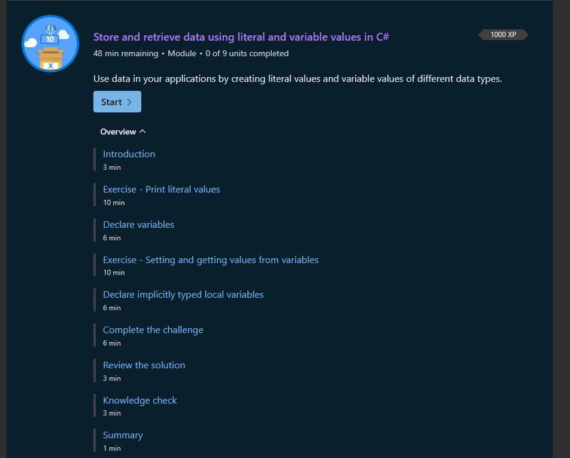

# Intro

Introduction
Completed
100 XP
3 minutes
Many of the applications that you'll build in C# will require you to work with data. Sometimes that data will be hard-coded in your application. Hard-coded values are values that are constant and unchanged throughout the execution of the program. For example, you may need to print a message to the user when some operation succeeds. A "success" message would likely be the same every time the application is executed. This hard-coded value can also be called a constant, or a literal value.

Suppose you want to display a formatted message to the end user containing different types of data. The message would include hard-coded strings combined with information your app collects from the user. To display a formatted message, you'll need to create both hard-coded values and define variables that can store data of a certain type, whether numeric, alphanumeric, and so on.

In this module, you'll create literal values that contain different data types. You'll create variables that can hold certain data types, set those variables with a value, then retrieve those values later in code. And finally, you'll learn how you can simplify your code by allowing the compiler to shoulder some of the work.

By the end of this module, you'll be able to create literal values and store and retrieve data in variables.

Learning objectives
In this module, you will:

Create literal values for five basic data types
Declare and initialize variables
Retrieve and set values in variables
Allow the compiler to determine the data type for your variable when initializing
Prerequisites
Must understand basic C# syntax rules
Must understand how to use Console.WriteLine()
Beginner level experience with a .NET editor

What is a literal value?
A literal value is a constant value that never changes. Previously, you displayed a literal string to the output console. In other words, you literally wanted that string of alphanumeric characters H, e, l, l, o, and so on, displayed in the output console.

Use the string data type whenever you have alphanumeric words, phrases, or data for presentation, not calculation. What other kinds of literal data can you print to output?

Exercise - Print different literal data types
There are many data types in C#. But as you're getting started, you only need to know about five or six data types since they cover most scenarios. Let's display a literal instance of data type to output.

 Note

You may notice as you begin to work in the code window that it colors certain syntax in different colors to indicate keywords, operators, data types and more. Begin to take notice of the colors. It can help you spot syntax errors as you enter characters, and can help you understand the code more effectively.

Use character literals
If you only wanted a single alphanumeric character printed to screen, you could create a char literal by surrounding one alphanumeric character in single quotes. The term char is short for character. In C#, this data type is officially named "char", but frequently referred to as a "character".

Add the following line of code in the code editor:

C#

Copy
Console.WriteLine('b');
Observe the code you entered.

Notice that the letter b is surrounded with single quotation marks 'b'. Single quotes create a character literal. Recall that using double quotation marks creates a string data type.

Press the green Run button to run your code. You should see the following result in the output window:

Output

Copy
b
If you enter the following code:

C#

Copy
Console.WriteLine('Hello World!');
You would get the following error:

Output

Copy
(1,19): error CS1012: Too many characters in character literal
Notice the single quotation marks surrounding Hello World!. When you use single quotation marks, the C# compiler expects a single character. However, in this case, the character literal syntax was used, but 12 characters were supplied instead!

Just like the string data type, you use char whenever you have a single alphanumeric character for presentation (not calculation).

Use integer literals
If you want to display a numeric whole number (no fractions) value in the output console, you can use an int literal. The term int is short for integer, which you may recognize from studying math. In C#, this data type is officially named "int", but frequently referred to as "integer". An int literal requires no other operators like the string or char.

Add the following line of code in the code editor:

C#

Copy
Console.WriteLine(123);
Press the green Run button to run your code. You should see the following result in the output console:

Output

Copy
123
Use floating-point literals
A floating-point number is a number that contains a decimal, for example 3.14159. C# supports three data types to represent decimal numbers: float, double, and decimal. Each type supports varying degrees of precision.

Output

Copy
Float Type    Precision
----------------------------
float         ~6-9 digits
double        ~15-17 digits
decimal        28-29 digits
Here, precision reflects the number of digits past the decimal that are accurate.

Add the following line of code in the code editor:

C#

Copy
Console.WriteLine(0.25F);
To create a float literal, append the letter F after the number. In this context, the F is called a literal suffix. The literal suffix tells the compiler you wish to work with a value of float type. You can use either a lower-case f or upper-case F as the literal suffix for a float.

Press the green Run button to run your code. You should see the following result in the output console:

Output

Copy
0.25
Notice that the float data type is the least precise, so it's best to use this data type for fixed fractional values to avoid unexpected computation errors.

Add the following line of code in the code editor:

C#

Copy
Console.WriteLine(2.625);
To create a double literal, just enter a decimal number. The compiler defaults to a double literal when a decimal number is entered without a literal suffix.

Press the green Run button to run your code. You should see the following result in the output window:

Output

Copy
2.625
Add the following line of code in the code editor:

C#

Copy
Console.WriteLine(12.39816m);
To create a decimal literal, append the letter m after the number. In this context, the m is called a literal suffix. The literal suffix tells the compiler you wish to work with a value of decimal type. You can use either a lower-case m or upper-case M as the literal suffix for a decimal.

Press the green Run button to run your code. You should see the following result in the output console:

Output

Copy
12.39816
Use Boolean literals
If you wanted to print a value representing either true or false, you could use a bool literal.

The term bool is short for Boolean. In C#, they're officially referred to as "bool", but often developers use the term "Boolean".

Add the following lines of code in the code editor:

C#

Copy
Console.WriteLine(true);
Console.WriteLine(false);
Press the green Run button to run your code. You should see the following result in the output console:

Output

Copy
True
False
The bool literals represent the idea of truth and falsehood. You'll use bool values extensively when you start to add decision logic to your applications. You'll evaluate expressions to see whether the expression is true or false.

Why emphasize data types?
Data types play a central role in C#. In fact, the emphasis on data types is one of the key distinguishing features of C# compared to other languages like JavaScript. The designers of C# believed they can help developers avoid common software bugs by enforcing data types. You'll see this concept unfold as you learn more about C#.

Data types define capabilities
Earlier, you saw that strings and chars are used for "presentation, not calculation". If you need to perform a mathematical operation on numeric values, you should use an int or decimal. If you have data that is used for presentation or text manipulation, you should use a string or char data type.

Suppose you needed to collect data from a user, like a phone number or postal code. Depending on the country/region where you live, that data may consist of numeric characters. However, since you rarely perform mathematical calculations on phone numbers and postal codes, you should prefer to use a string data type when working with them.

The same can be said of bool. If you need to work with the words "true" and "false" in your application, you would use a string. However, if you need to work with the concept of true or false when performing an evaluation, you use a bool.

It's important to know that these values may look like their string literal equivalents. In other words, you may think these statements are the same:

C#

Copy
Console.WriteLine("123");
Console.WriteLine(123);

Console.WriteLine("true");
Console.WriteLine(true);
However, it's only the displayed output that appears to be similar. The fact is that the kinds of things you can do with the underlying int or bool will be different than their string equivalent.

Recap
The main takeaway is that there are many data types, but you'll focus on just a few for now:

string for words, phrases, or any alphanumeric data for presentation, not calculation
char for a single alphanumeric character
int for a whole number
decimal for a number with a fractional component
bool for a true/false value
Next unit: Declare variables